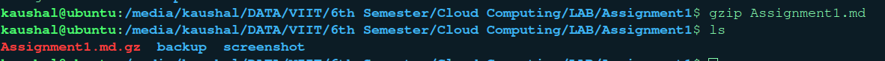

```
Name: Kaushal Khachane
Roll No: 322073
PRN: 22220110
Div:B
Batch: B3
```

# Assignment 1: List 50 Linux Commands

### Directory Commands
`1. pwd: print the working directory`


`2. cd: change directory`


`3. mkdir: create new directory`


`4. rmdir: Remove an empty directory`


`5. mv: Move or rename directories`


`6. tree: Display directory tree structure`


### Files Commands

`7. ls: list files and directory`


`8. cp: Copy files or directories.`


`9. mv: Move or rename files and directories.`


`10. rm: Remove/delete files or directories.`


`11. touch: Create an empty file or update file timestamps.`


`12. cat: Display the contents of a file.`


`13. nano: A simple text editor`


`14. grep: Search for patterns in files.`


`15. find: Search for files in a directory hierarchy.`


`16 chmod: Change file permissions.`


### Process Commands:

`17. ps: display information aout active process`


`18. top: Display dynamic real-time system statistics`


`19. kill: Send a signal to a process`


`20. pstree: Display a tree diagram of processes`


### System Information

`21. df: Displays information about disk space usage on the file system.`


`22. du: Shows the disk space used by a file or directory, including its subdirectories.`


`23. Creates a new tar archive and specifies the file to be archived.`


`24. free: Displays information about system memory usage`


`25. gzip: gzip is a compression utility used to compress files. It replaces the original file with a compressed version that has a .gz extension. `


`26. gzip -d: Decompresses files compressed with gzip.`


`27. gunzip:  is a command-line tool that decompresses files compressed with gzip, restoring them to their original state. `


### Networking Command

`28. ping: The ping command is used to test the reachability of a host on an Internet Protocol (IP) network. `


`29. ifconfig: The ifconfig command is used to configure network interfaces and display information about them on Unix-like operating systems`


`30. curl: The curl command is a tool for making HTTP requests and interacting with various network protocols. It is widely used for downloading files, sending data to web servers, and testing APIs from the command line`


`31. wget: The wget command is a tool for downloading files from the internet. It supports HTTP, HTTPS, and FTP protocols and allows users to download files or entire web pages from the command line`


### System Information Basics Command

`32. uname: The uname command is used to display system information on Unix-like operating systems. It provides details about the system name, kernel version, and other system-related information`


`33. date: The date command is used to display or set the system date and time`


`34. cal: The cal command displays a calendar for the current month or a specified year and month`


`35. uptime: The uptime command shows how long the system has been running, along with load averages `


`36. who: The who command displays information about currently logged-in users on the system`


`37 passwd: The passwd command is used to change a user's password`


### User and Permissions Commands:

`38. sudo: The sudo command is used to execute a command with elevated privileges, typically as the superuser or another specified user, as allowed by the security policy configured in the /etc/sudoers file`


`39. man: The man command is used to display the manual (documentation) pages for Unix and Linux commands. It provides detailed information, options, and usage examples for a given command`


`40: history: The history command displays a list of previously executed commands from the command-line history. It allows users to view and recall past commands`


### File Viewing and Editing

`41. head: The head command displays the beginning lines of a file or input from a command, by default, the first 10 lines`


`42. tail: he tail command displays the last lines of a file or input from a command, by default, the last 10 lines`


### Shell and Terminal

`43. echo: Prints text or variables to the console`


`44. printf: Formats and prints data to the console`


`45. exit: Exits the current shell or terminal session.`


`46. hostname: Display or set the system's hostname`


`47. route -n: Display or manipulate the IP routing table.`

