```
Name: Kaushal Khachane
Roll No: 322073
PRN: 22220110
Div:B
Batch: B3
```

### Title: Write IaC using terraform to create EC2 machine on AWS or Azure or Google cloud. (Compulsory to use Input and output variable files)

##### Aim: Writing Infrastructure as Code (IaC) using Terraform to create an EC2 machine on a cloud platform such as AWS, Azure, or Google Cloud is to help students gain practical experience in using Terraform to provision infrastructure resources

##### What is Terraform -->
Terraform is an infrastructure as code solution that makes it safe and effective to create, modify, and version cloud and on-premise resources. Both cloud and on-premises resources can be specified using human-readable configuration files that can be reused and shared. It aids in maintaining a streamlined workflow for the provisioning and lifecycle management of all of your infrastructure.

## Steps:
`1. Download Terreaform`


`2. Check the version of the installed terraform`
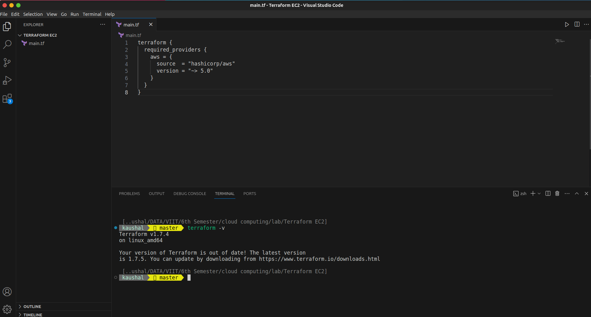

`3. Install or Update AWS CLI`
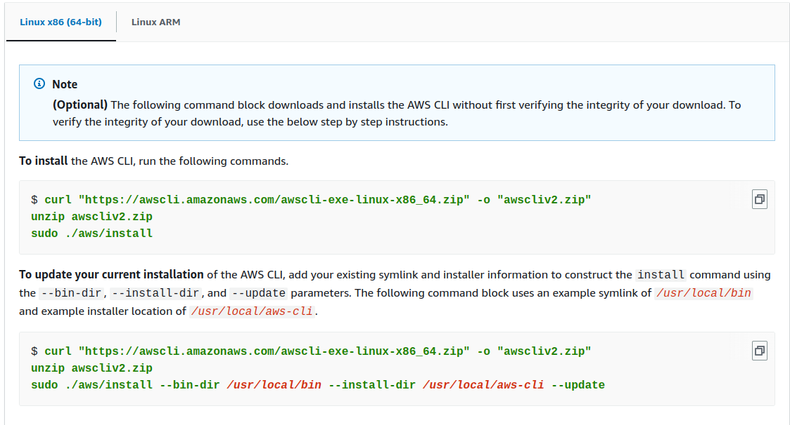

`4. Login to aws console search for IAM user`
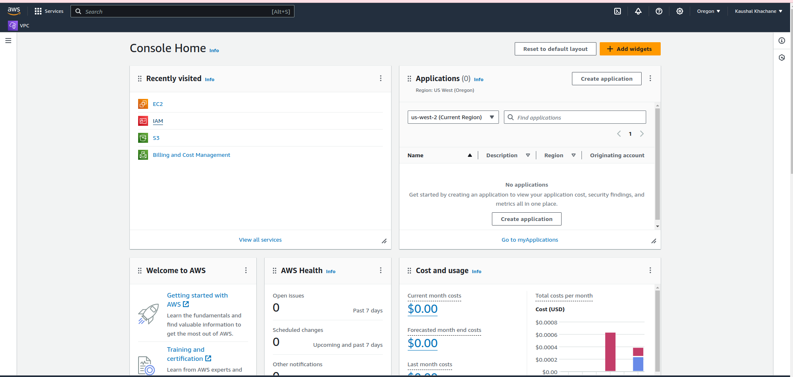

`5. Go to the IAM User tab and create IAM user there (terraform-admin)`
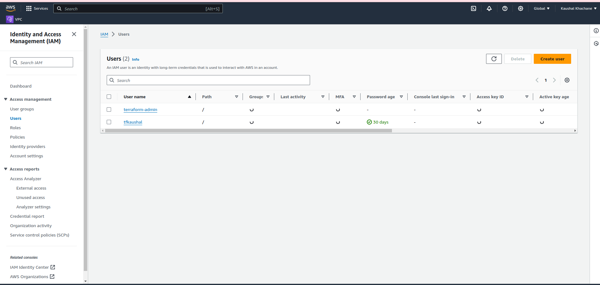

`6. Click on Created User and navigate to Security Credentails Tab`


`7. Generate Access Keys, Download Access Keys CSV File or Copy Key`
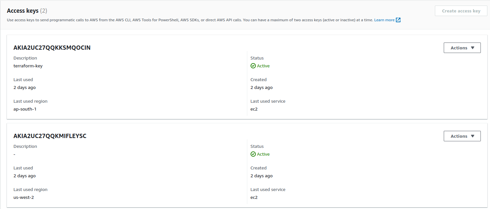

`8. Keep Access Key ID & Secreat Key Stored Somewhere`


`8. Configure Copied Access Key ID and Secreat Access Key from Console`


#### Now that our Command Line is connected to the AWS Console, all we need to do is write a Terraform configuration file that will create an EC2 instance in the AWS Console.

`This code snippet specifies that the provider to be used is AWS.`
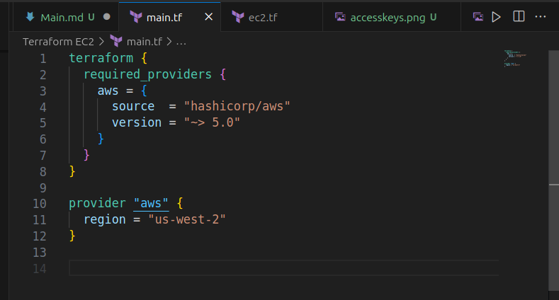

`Code Below create ec2 instance in us-west-2 region Here we specified resource as aws_instance (EC2), AMI number of Amazon machine, instance type and optional tag name`


## Now, we simply apply Terraform lifecycle commands here.

`As of now, we can see that there are no instances under the US West (Oregon) region (us-west-2).`
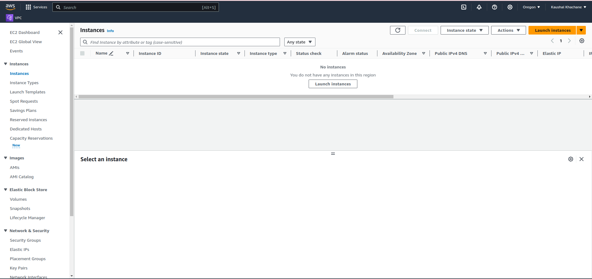

## 1. terraform init --> Initialization

`Purpose:-` This phase initializes a Terraform working directory by downloading and configuring any necessary plugins and modules

`Process:-` When you run `terraform init`, Terraform reads the configuration files (*.tf) in the current directory and downloads the necessary provider plugins specified in the configuration.


As we can see, after the `init` command, new files created in the current working directory.


## 2. terraform validate --> Validation

`Purpose:-` This optional phase checks the syntax and structure of the Terraform configuration files for errors

`Process:-` Running `terraform validate` ensures that the configuration adheres to the correct syntax, which is particularly useful for catching errors early in the development process.


## 3. terraform fmt --> Formatting
`Purpose:-` This optional phase formats the Terraform configuration files to ensure consistent style and indentation

`Process:-` Running `terraform fmt` applies a standard formatting to the configuration files, promoting readability and consistency across the codebase.


## 4. terraform plan --> Planning
`Purpose:-` Terraform generates an execution plan based on the configuration files, comparing the desired state with the current state of the infrastructure.

`Process:-` erraform analyzes dependencies, determines the order of operations, and identifies any changes required to achieve the desired state. Running `terraform plan` provides a preview of changes without actually applying them, allowing for a review of the proposed modifications.
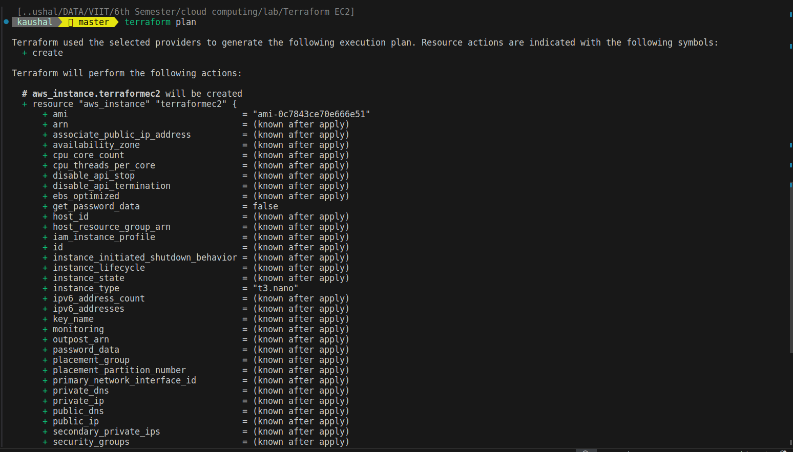
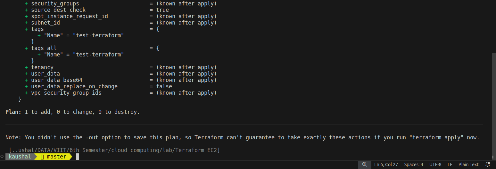

## 5. terraform apply --> Execution
`Purpose:-` During this phase, Terraform applies the changes outlined in the execution plan to the infrastructure.

`Process:-` Terraform creates, updates, or deletes resources as necessary to match the desired state specified in the configuration. Running `terraform apply` executes the planned changes, provisioning or modifying infrastructure resources accordingly.
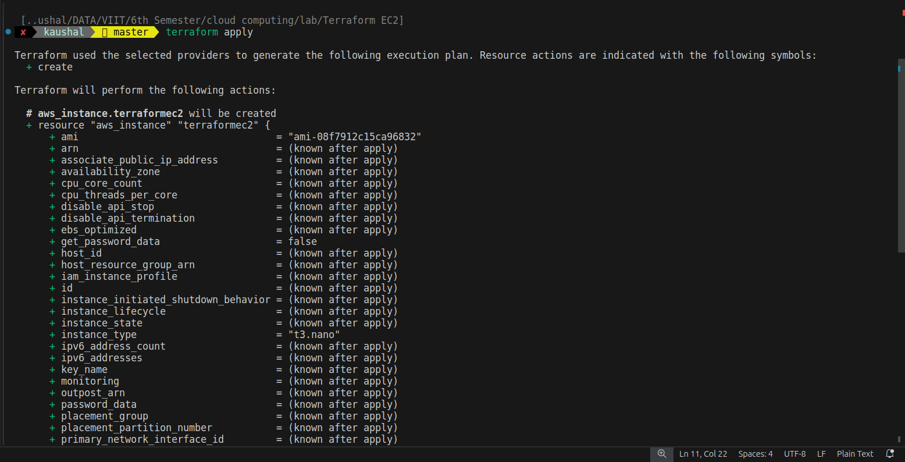

As we can see here, an EC2 instance has been successfully created under the same region, us-west-2.
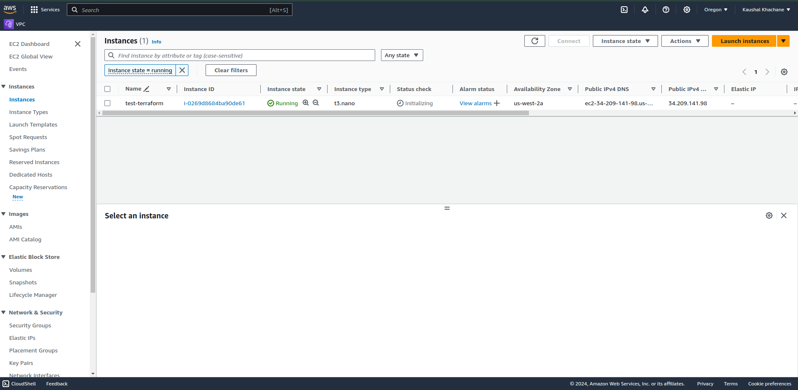

## 6. terraform destroy --> Destruction
`Purpose:-` Finally, if you no longer need the infrastructure provisioned by Terraform, the `terraform destroy` command removes all resources managed by Terraform.

`Process:-` This phase ensures that all resources provisioned by Terraform are properly cleaned up, preventing ongoing costs and leaving the environment in a desired state.
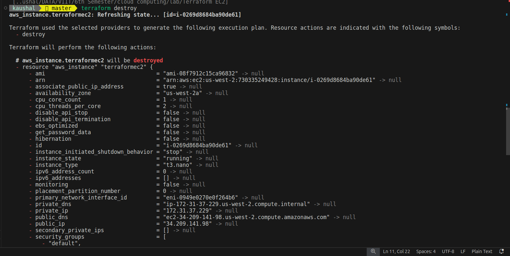
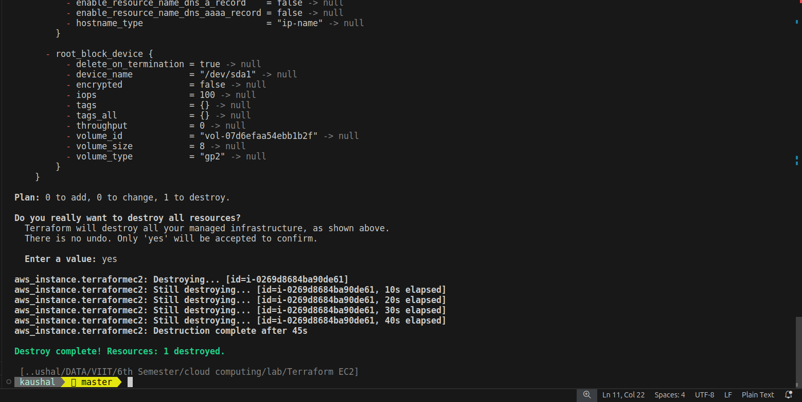
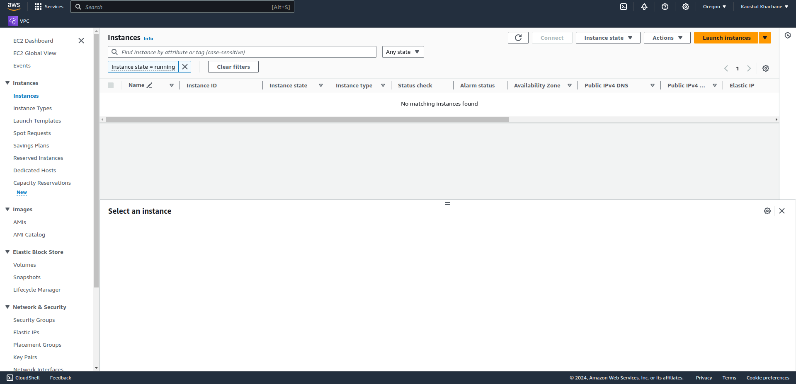
